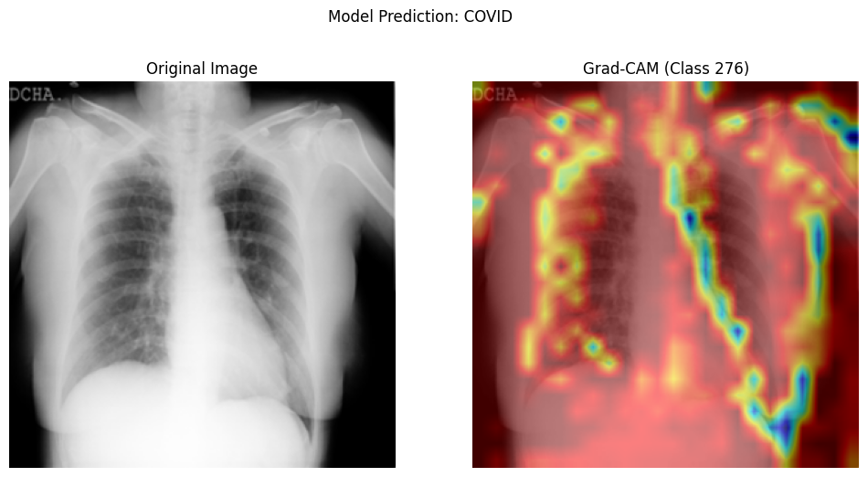

## The Silent Crisis in Lung Health

Every year, respiratory diseases claim over 4 million lives globally. During the COVID-19 pandemic, we witnessed firsthand how critical early detection is for lung conditions. But with radiologists overwhelmed and diagnostic resources scarce in many regions, there's an urgent need for accessible screening tools.

Enter **X-RayGuard** - our open-source deep learning solution that brings hospital-grade diagnostic capabilities to any device with a camera.

---

## How X-RayGuard Works

### Cutting-Edge Architecture

```python
from tensorflow.keras.applications import MobileNetV2

model = tf.keras.Sequential([
    MobileNetV2(input_shape=(96,96,3), 
    GlobalAveragePooling2D(),
    Dense(64, activation='relu'),
    Dropout(0.3),
    Dense(3, activation='softmax')  # COVID/Normal/Pneumonia
])
```

Our transfer learning approach leverages MobileNetV2's powerful feature extraction capabilities, fine-tuned with specialized layers for medical imaging. The model accepts 96x96 pixel X-ray images and outputs probability distributions across three critical classes.

---

### Unprecedented Transparency

What sets LungVisionAI apart is its explainability through Grad-CAM technology:



Model highlights decision regions - critical for doctor validation

---

## Performance That Matters

Metric       | COVID-19      | Normal        | Pneumonia
------------ | ------------- | ------------- | -------------
Precision    | 89%           | 95%           | 94%
Recall       | 88%           | 96%           | 92%
F1-Score     | 88%           | 95%           | 93%

**Overall Accuracy: 93.5%** - validated on 3,031 test images from diverse sources.

---

## GitHub Repository

::github{repo="RaitonRed/X-RayGuard"}

---

Disclaimer: **Always validate AI predictions with certified medical professionals. This tool assists but doesn't replace human diagnosis.**